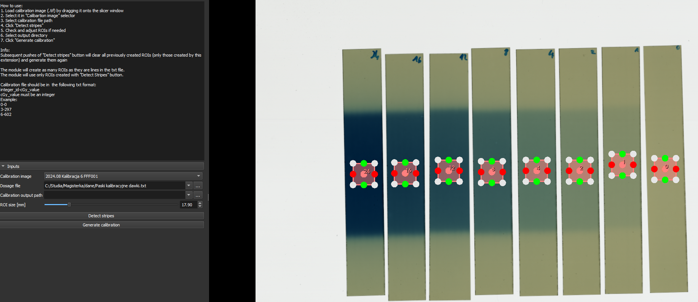
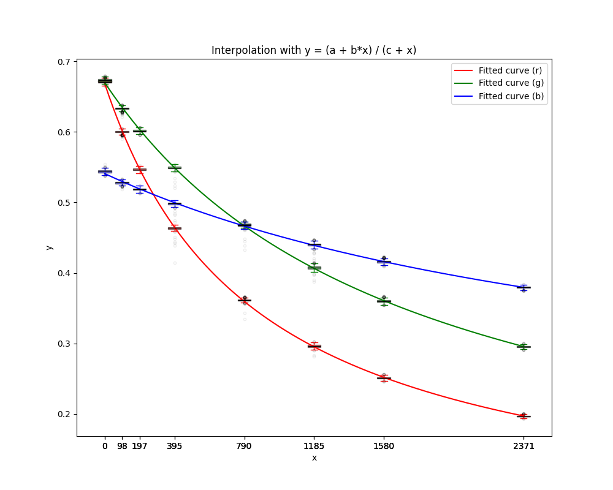
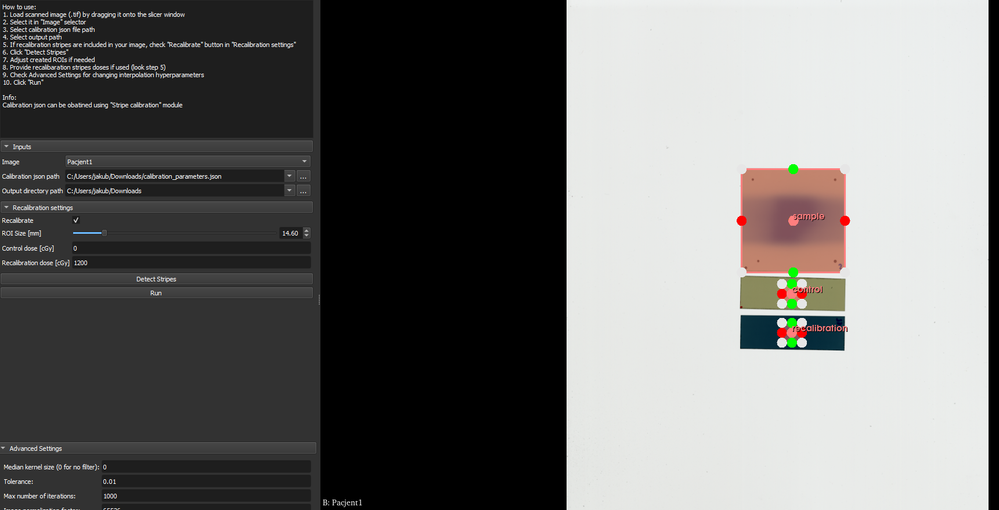
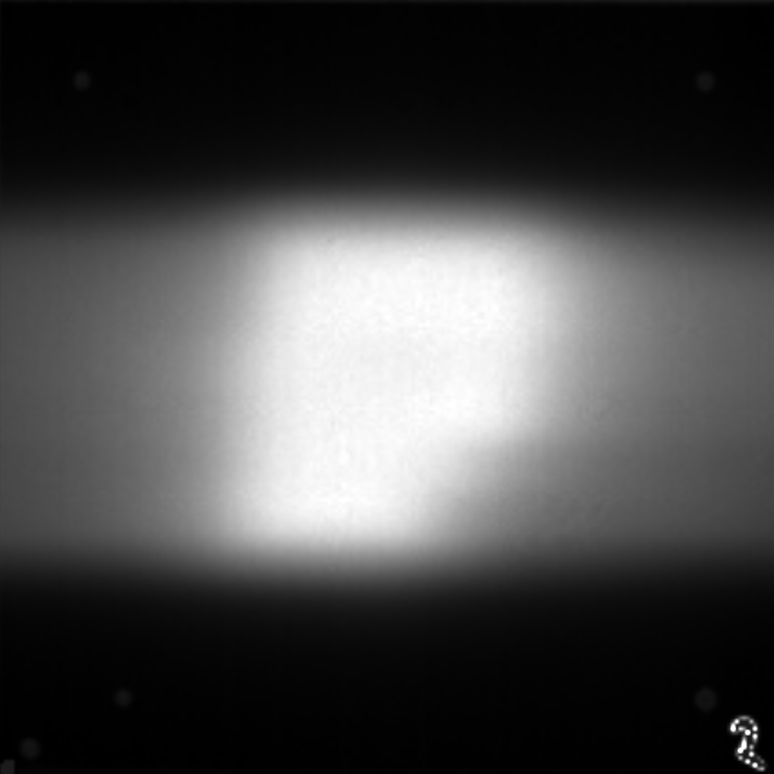
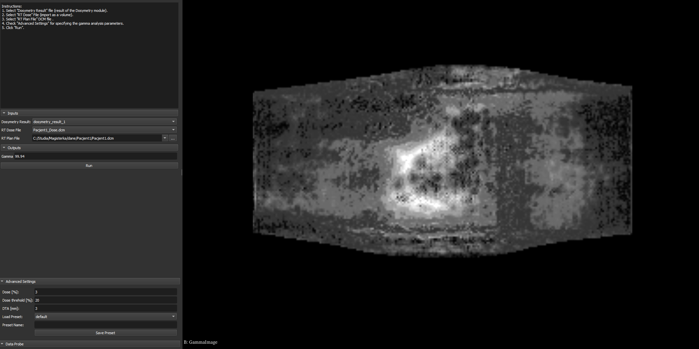
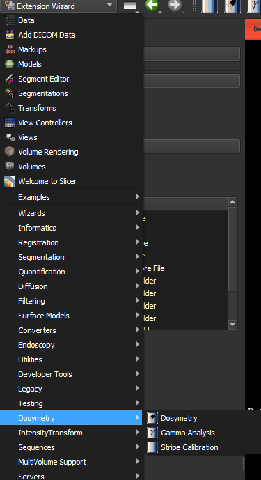

# Dosymetry Extension for Slicer

This is a extension for Slicer which is designed to help radiology technicians with preparing treatments.  
It consists of 3 modules: **Stripe Calibration**, **Dosymetry**, **Gamma analysis**

## Stripe Calibration
**Stripe Calibration** automatically detects radiation-sensitive stripes and creates an interoplated function of dose by RGB value.  





## Dosymetry
**Dosymetry** provided test sample stripe and calibration parameters created by **Stripe Calibration** it caluclates does distribution on the sample stripe.  





## Gamma analysis
**Gamma analysis** provided dosymetry result created by **Dosymetry**, dose DCIM volume and treatment plan DCIM file it perfomrs gamma analysis and returns gamma index.  




## How to install

1. Download zip file of this extension and unzip it or run:  
```
git clone https://github.com/HulekJakub/slicer_dosymetry.git --single-branch
```

Advantage of using git clone is that you can easily update it by entering the directory it is saved in and running:  
```
git pull
```

2. Open the slicer and select **Extension Wizard** module from **Developer tools** list.
3. Click the "Select extension" button.
4. Find the location of the extension and select it (make sure to select the extension directory (**slicer_dosymetry**), **not** the individual module name).
5. Agree to adding everything to "additional module paths".
6. It's done. Please restart Slicer so that the extension can import any Python library it may need.  



## Contact
For any bug reports or imporvement suggestion please contact me at jakub.hulek01@gmail.com  
