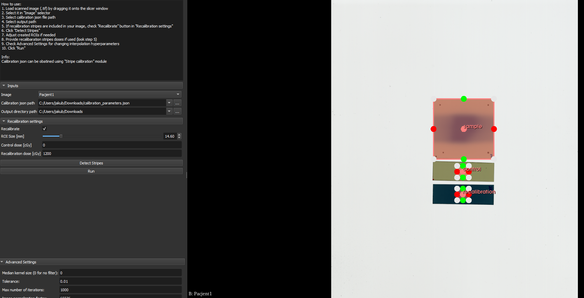
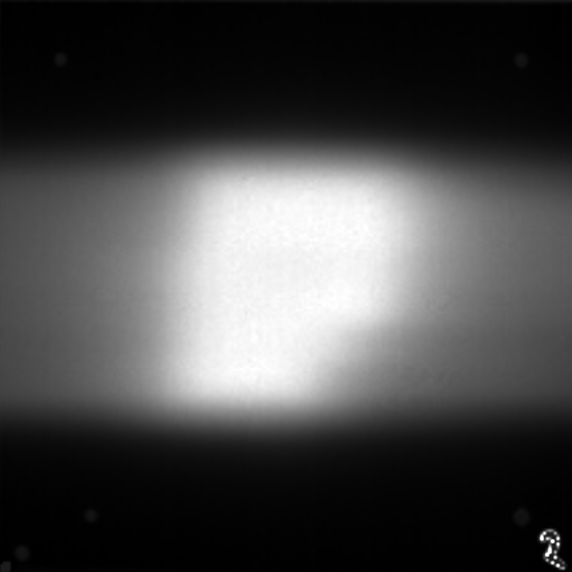
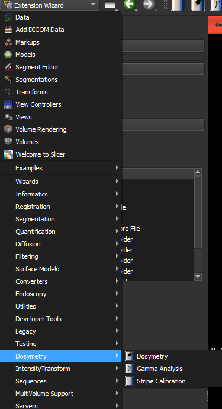

# Dosimetry Extension for Slicer

This is an extension for Slicer designed to help radiology technicians prepare treatments.  
It consists of three modules: **Stripe Calibration**, **Dosimetry**, and **Gamma Analysis**.

## Stripe Calibration
**Stripe Calibration** automatically detects radiation-sensitive stripes and creates an interpolated function of dose by RGB value.  


## Dosimetry
**Dosimetry** takes a test sample stripe and calibration parameters created by **Stripe Calibration** to calculate the dose distribution on the sample stripe.  




## Gamma Analysis
**Gamma Analysis** performs gamma analysis using the dosimetry results from **Dosimetry**, a dose DICOM volume, and a treatment plan DICOM file. It then returns the gamma index.  


## How to Install

1. Download the ZIP file of this extension and unzip it, or run:  
   ```
   git clone https://github.com/HulekJakub/slicer_dosimetry.git --single-branch
   ```
   The advantage of using `git clone` is that you can easily update it by navigating to the directory where it is saved and running:  
   ```
   git pull
   ```

2. Open Slicer and select the **Extension Wizard** module from the **Developer Tools** list.
3. Click the **Select Extension** button.
4. Locate and select the extension directory (**slicer_dosimetry**)—**not** an individual module file.
5. Confirm adding everything to "Additional Module Paths."
6. You're done! Please restart Slicer so the extension can import any necessary Python libraries.  



## Contact
For bug reports or improvement suggestions, please contact me at **jakub.hulek01@gmail.com**.
